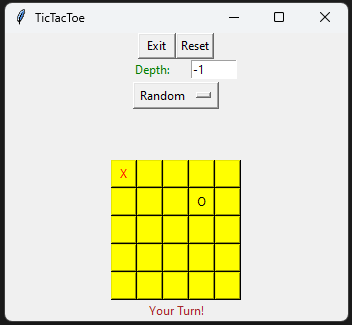

# Tic-Tac-Toe Adversarial Agent

This is a project template from UC Berkeley, for an adversarial agent. This specific implementation is for playing Tic Tac Toe, allowing users to choose board size and difficulty level. The agent utilizes various search algorithms including, but not limited to; Alpha-Beta Pruning, Expectimax, and Minimax. Each algorithm is implemented both with and without cutoff distances to allow users to experiment with different strategies and observe their impact on gameplay. The project provides an interactive interface where users can play against the adversarial agent, selecting the board size and difficulty level according to their preference. 

## Features

- **Selectable Board Size:** Games can be played at any selectable n x n board size. Note; larger boards with certain algorithms may run slower during testing.

- **Selectable Difficulty:** Utilize simpler/more advanced search algorithms or lower/higher cutoff depths to lower/raise the difficulty,

- **Unwinnable difficulty:** The games become very difficult/unwinnable at certain difficulties, utilizing cutoff depth and evaluation functions to adjust adversarial bot optimization.

## How does it work?

Using a tkinter UI to display the game state, users can select the algorithm utilized by the adversarial agent, as well as the cutoff depth, creating an adjustable difficulty. The game is unwinnable with past certain cutoff depths as the evaluation function can optimally decide how to block users from winning, it is however very rare for the adversarial bot to win, with draws being the most likely outcome. Large cutoff depths in conjunction with large board sizes may lead to performance issues due to this.

<p align="center">
 
</p>

## Algorithms

- **Minimax:** A decision-making algorithm used in adversarial games to determine the optimal move for a player, considering the possible moves of both player and bot to select the one that minimizes the maximum possible loss.

- **Alpha-Beta Pruning** A search algorithm used to reduce the number of nodes evaluated by the minimax algorithm. It prunes branches of the search tree that cannot influence the final move, thus improving efficiency without affecting the final result.

- **Expectimax:** An extension of the minimax algorithm that takes uncertainty in the game into account during decision-making, typically used in games with chance elements like dice rolls or card draws. In the context of this game, each move is equally likely to occur.

- **Cutoff Algorithms:** These algorithms are used to limit the depth of the search in the game tree, reducing the complexity of the search.

## Requirements

- Python 3.x

- Modules: `Numpy`

## Installation and Use

Follow these steps to set up and run the Tic-Tac-Toe game:

1. Download or clone the repository to your local machine:

   ```bash
   git clone https://github.com/Daksh2060/tictactoe-adversarial-opponent
   ```

2. Install `Numpy` if not already installed:

 - **numpy:** [Install numpy with pip](https://numpy.org/install/)

 - **pip:** [Install pip (usually included with python)](https://pip.pypa.io/en/stable/installation/)

3. Run `tic-tac-toe.py` to start the game.

4. To specify board size, follow the launch command with the following, this will result in a 3 x 3 game board, and if left blank will default to a 5 x 5:

  ```bash
  C:/Users/.../python.exe c:/Users/.../tictactoe-adversarial-opponent/tic-tac-toe.py 3 3 3
  ```

5. Adjust the difficulty by choosing a search algorithm, and if using a cutoff variant, adjust the cutoff distance.
  
## Contact

Feel free to reach out if you have any questions, suggestions, or feedback:

- **Email:** dpa45@sfu.ca
- **LinkedIn:** [@Daksh Patel](https://www.linkedin.com/in/daksh-patel-956622290/)

